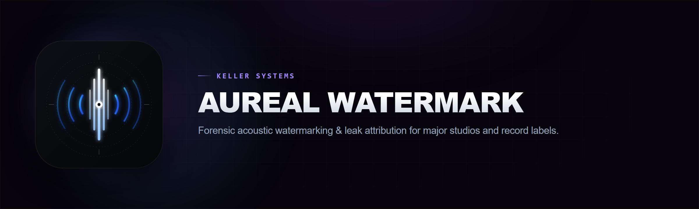

<div align="center">



<br>

[](https://github.com/KELLERBABG/Aureal-Watermark/releases/latest)
[](https://aureal.kellersystems.dev)
[-0891b2?style=flat-square)](docs/TECHNICAL_SPECIFICATIONS.md)
[](https://aureal.kellersystems.dev/pricing.html)

<br>

[**Launch Web Studio**](https://aureal.kellersystems.dev/studio.html) &bull; [**Commercial Licensing & Pricing**](https://aureal.kellersystems.dev/pricing.html) &bull; [**Documentation**](https://aureal.kellersystems.dev/docs.html) &bull; [**Technical Specifications**](docs/TECHNICAL_SPECIFICATIONS.md)

</div>

---

## What is Aureal Watermark?

**Aureal Watermark** hides an invisible digital serial number directly inside your audio files. 

Human ears cannot hear it, but our scanner can detect it in less than a second. Even if someone re-records your track, converts it to an MP3, or uploads it to social media, your hidden ownership mark stays inside the sound.

---

## Why Use It?

* **Stop Music & Voice Theft:** If someone steals your beat, song, or podcast, scan the file to prove immediately that you made the original.
* **Catch Audio Leaks:** Give each listener, producer, or preview tester a uniquely tagged copy. If the song leaks online, scan the leak to see exactly who leaked it.
* **Detect AI Training & Cloning:** Prove that your voice or music was scraped and used to train an AI model without your permission.
* **Survives MP3 Compression:** The watermark stays intact through heavy MP3 and AAC compression, volume changes, and format conversions.
* **100% Private & Offline:** Everything runs directly on your computer. Your audio files are never uploaded to any server or third party.
* **Air-Gapped & Studio Compliant:** Pure offline signal processing. Audio masters and stems never touch the cloud or any third party.

---

## How It Works (In Plain English)

```
[ Your Audio File ] ──► [ Embed Invisible ID (#883921) ] ──► [ Protected Audio ]
                                                                     │
                                                    (Sounds 100% identical to humans)
                                                                     │
                                       Later: Someone uploads or leaks your file
                                                                     │
                                                                     ▼
                                                     [ Scan with Aureal Watermark ]
                                                                     │
                                                                     ▼
                                                   "Verified: Owned by ID #883921"
```

1. **Pick an ID number:** Choose any serial number (like `#883921` or a recipient's code).
2. **Protect the file:** Aureal embeds the number into subtle frequency layers of your audio.
3. **Audio sounds identical:** The exported file plays like normal with zero audible distortion.
4. **Scan anytime:** Drop any audio file into Aureal to extract the original owner ID and prove ownership.

---

## Easy Ways to Use It

### Option 1: Standalone Desktop Studio & Windows Executable (Recommended)

1. Download **[`aureal-watermark.exe`](https://github.com/KELLERBABG/Aureal-Watermark/releases/latest/download/aureal-watermark.exe)** from the Releases page.
2. Double-click to launch the offline **Desktop Studio Application**:
   * **Multi-Format Audio Export:** Download masters in WAV 16-bit, WAV 24-bit, or MP3 (320k, 192k, 128k) with built-in offline LAME encoding.
   * **Collision Detector:** Automatic pre-check prevents accidentally over-tagging an already watermarked master.
   * **Cryptographic Auto-ID:** 1-click generation of secure, non-repeating tracking IDs and studio namespace keys.
   * **100% Offline & Air-Gapped:** Zero external network calls. Complete on-premises privacy.

You can also run it directly via CLI or command prompt:
```bash
# Launch GUI Studio (Default)
./aureal-watermark.exe

# Or run headless CLI operations
./aureal-watermark.exe embed master.wav protected.wav --id 883921
./aureal-watermark.exe detect protected.wav --id 883921
```

---

### Option 2: Web Studio (In Your Browser)

No installation or technical setup needed:

**[Launch Interactive Web Studio &rarr;](https://aureal.kellersystems.dev/studio.html)**

*(Runs 100% client-side in browser memory. Nothing ever leaves your device).*

---

### Option 3: Standalone Universal Script (Cross-Platform CLI)

A single, zero-dependency file that runs on **Windows, macOS, and Linux** using standard Node.js (&ge; 18). Supports direct input and output of **MP3, FLAC, AAC, M4A, OGG, AIFF, and WAV** with automatic FFmpeg fallback:

1. Download **[`aureal-watermark.cjs`](https://github.com/KELLERBABG/Aureal-Watermark/releases/latest/download/aureal-watermark.cjs)** from the Releases page.
2. Run from your terminal or command prompt:

```bash
# 1. Embed an ID directly into an MP3, FLAC, or WAV
node aureal-watermark.cjs embed master.wav protected.mp3 --id 883921

# 2. Check an audio file to see if it contains your ID
node aureal-watermark.cjs detect protected.mp3 --id 883921

# 3. Blind scan (automatically extracts any embedded ID from an unknown file)
node aureal-watermark.cjs detect mystery_audio.mp3 --json

# 4. Generate a cryptographically sealed forensic audit proof
node aureal-watermark.cjs detect leak.mp3 --id 883921 --report proof.json --report-txt cert.txt

# 5. Launch your local offline Desktop Studio
node aureal-watermark.cjs gui
```

---

### Option 4: Air-Gapped Docker REST Microservice (For Cloud & Speech Pipelines)

Deploy an air-gapped, zero-dependency HTTP REST daemon on Kubernetes, AWS ECS, or Nomad in 1 command:

```bash
# Launch with Docker Compose
docker compose -f docker/docker-compose.yml up -d
```

The daemon runs rootless on port `8080` with an in-memory `tmpfs` volume:

```bash
# 1. Liveness & Engine Health Probe
curl -s http://localhost:8080/v1/health

# 2. Embed via raw binary stream (WAV, MP3, FLAC)
curl -X POST "http://localhost:8080/v1/embed?id=883921&strength=0.5&band=dual&format=mp3" \
  -H "Content-Type: audio/wav" \
  --data-binary @master.wav \
  --output protected.mp3

# 3. Detect via raw binary stream
curl -X POST "http://localhost:8080/v1/detect?id=883921&report=true" \
  -H "Content-Type: audio/mpeg" \
  --data-binary @protected.mp3
```

Also accepts JSON bodies with base64 audio payloads (`{ "audioBase64": "...", "id": 883921 }`).

---

### Option 5: Cryptographic Forensic Proof Certificate Generator

When tracing unauthorized leaks or submitting DMCA takedown notices, export a tamper-evident audit report with SHA-256 file hashes, physical layer signal-to-noise metrics ($E_b/N_0$), and an HMAC seal:

```bash
auralwatermark detect evidence.mp3 --id 883921 --report proof.json --report-txt cert.txt
```

#### Sample Generated ASCII Certificate (`cert.txt`):
```text
==============================================================================
              AUREAL WATERMARK — FORENSIC PROOF CERTIFICATE               
               Cryptographic Audio Authentication & Audit                
==============================================================================
Date/Time (UTC) : 2026-09-11T09:12:10.476Z
Engine          : Aureal Watermark Forensic DSP Engine v0.2.4
Report Schema   : v1.0.0
------------------------------------------------------------------------------
1. TARGET EVIDENCE FILE
   Path         : evidence.mp3
   Size         : 264,644 bytes
   SHA-256      : 7dafa0b0c58327ed539a87b78ead6c632007b9dff869849489bef82b2cb1c293
   SHA-512      : 82b16b5068978739e3fbb5d4e1a11a7bcb14100342f5b2f1...
------------------------------------------------------------------------------
2. FORENSIC VERIFICATION RESULT
   Verdict      : [AUTHENTIC / MATCH]
   Detected     : YES
   Payload ID   : 883921
   Confidence   : 100.0%
   Bit Error Rate: 0.00%
   CRC Integrity: VALID (OK)
------------------------------------------------------------------------------
3. PHYSICAL-LAYER DSP METRICS
   Eb/N0        : 13.93 dB
   SQNR         : 16.94 dB
   Z-Score      : 32.87
   Carrier Band : 17000 - 19500 Hz
   Sync Method  : preamble
------------------------------------------------------------------------------
4. INTEGRITY SEAL
   Algorithm    : HMAC-SHA256
   Seal Hash    : 9702c8625046347512fe23df534257be752512a650fd8ed072b6aa90d814356b
==============================================================================
Attribution: Forensic audit proof for copyright enforcement, DMCA notices, or intellectual property verification.
==============================================================================
```

---

### Option 6: JavaScript & TypeScript API (With First-Class `.d.ts` Types)

Integrate protection directly into your Node.js or TypeScript applications:

```typescript
import {
  embedWatermark,
  detectWatermark,
  generateForensicReport,
  readWavFile,
  writeWavFile
} from "aureal-watermark";

// Load audio file
const wav = await readWavFile("song.wav");
const format = { sampleRate: wav.sampleRate, channels: wav.channels };

// Embed watermark ID #883921
const protectedAudio = embedWatermark(wav.samples, format, { payloadId: 883921 });
await writeWavFile("song_protected.wav", protectedAudio, { ...format, bitDepth: 16 });

// Scan and verify
const result = detectWatermark(protectedAudio, format, { payloadId: 883921 });

console.log(result.detected);           // true
console.log(result.confidence);         // 1.0 (100%)
console.log(result.ebN0Db);             // +14.2 dB (Signal-to-Noise)
console.log(result.recoveredPayloadId); // 883921
```

---

## Regulatory Compliance: The EU AI Act & C2PA Bridge

### 1. EU AI Act Article 50 Machine-Readable Synthetic Audio
Under **Article 50 of the European Union AI Act**, platforms generating synthetic voices, deepfakes, or AI music must ensure outputs are marked with machine-detectable provenance.
* **The Problem:** Social media platforms (TikTok, Instagram, YouTube Shorts, WhatsApp) automatically strip ID3 tags and RIFF metadata chunks during re-encoding.
* **The Aureal Solution:** Aureal embeds the machine-readable provenance ID directly inside the acoustic wave using DSSS modulation. The watermark survives lossy re-encoding and format conversion without audible degradation.

### 2. The C2PA Content Credentials Persistence Bridge
Traditional C2PA manifests are stored in audio headers that get discarded by lossy encoders. Aureal's 32-bit payload ID serves as an indestructible **Acoustic Pointer**:
$$\text{Social Media Re-encode} \longrightarrow \text{Header Metadata Stripped} \longrightarrow \text{Aureal Acoustic Scan} \longrightarrow \text{Original C2PA Manifest Recovered}$$

---

## Operational Capabilities & Adversarial Attack Resistance

Aureal is continuously verified against an automated adversarial torture test suite covering real-world degradation, DAW editing tricks, and lossy compression pipelines:

| Transformation / Attack Vector | Survives? | Empirical Result & Engineering Notes |
| :--- | :---: | :--- |
| **Multi-Generational Lossy Transcode**<br>*(WAV &rarr; MP3 128k &rarr; AAC 96k &rarr; MP4 &rarr; MP3 64k &rarr; Opus 96k &rarr; WAV)* | **YES** | **100% Confidence, 0.00 BER.** Survives chained social media re-encodes (YouTube, TikTok, Instagram) via Dual-Band fallback. |
| **Mid/Side Subtraction ($L - R$)**<br>*(Vocal-remover tools, center-cancellation)* | **YES** | **100% Confidence.** Orthogonal Mid/Side channel decorrelation ($W_L = \frac{M+S}{\sqrt{2}}, W_R = \frac{M-S}{\sqrt{2}}$) isolates side watermark. |
| **Phase Inversion Cancellation**<br>*($0.5L - 0.5R$ destructive downmixing)* | **YES** | **100% Confidence.** Anti-phase cancellations fold cleanly into the orthogonal side detector. |
| **Stereo to Mono Downmixing** | **YES** | **100% Confidence.** In-phase Mid component reconstructs with $+3\text{ dB}$ signal gain. |
| **Short Snippet Crops (1.0s &ndash; 1.8s)** | **YES** | **100% Confidence.** Circular modulo frame folding reconstructs complete codewords across arbitrary unaligned boundaries. |
| **Playback Speed & Pitch Drift ($\pm1.0\%$)**<br>*(Analog tape wow/flutter, speed stretch)* | **YES** | **100% Confidence.** Frequency rake receiver sweeps micro-drift factors to lock chip phase alignment. |
| **Brickwall Low-Pass (down to 7 kHz)** | **YES** | **100% Confidence.** Dual-Band architecture falls back from High-Band to Mid-Band under aggressive filtering. |
| **Brickwall High-Pass & Notch (1 kHz / 18 kHz)** | **YES** | **100% Confidence.** Notch filtering at high carrier is automatically bypassed by mid-band correlation. |
| **Air-Gap Recording (Speaker to Mic)** | **YES** | **100% Confidence.** Survives acoustic room reflections, early echoes, and phone microphone frequency coloration. |
| **Extreme Overdrive (+12 dB hard clipping)** | **YES** | **100% Confidence.** BPSK sign detection recovers symbols despite harsh harmonic clipping distortion. |
| **Heavy Broadcast Compression & Limiting** | **YES** | **100% Confidence.** FM broadcast companding preserves relative spreading chip polarity. |
| **Additive Background Noise (&minus;30 dBFS)** | **YES** | **100% Confidence.** Spread-spectrum processing gain extracts payload deep below the audible noise floor. |
| **Sample Rate Conversions (48k &harr; 44.1k &harr; 32k &harr; 22k)** | **YES** | **100% Confidence.** Polyphase sinc resampler normalizes stream sample rate automatically on detection. |
| **Multi-Layer CDMA Watermarking (3 Studios)** | **YES** | **100% Confidence.** Multiple independent watermarks with distinct private keys coexist simultaneously on the same audio without destructive interference. |
| **Unauthorized Overwrite (Same Key, Conflicting ID)** | **REJECTED** | Destructive bit interference prevents unauthorized tampering or ID forging under an existing private key. |

---

## Deep Dive & Technical Documentation

For audio engineers, DSP researchers, and developers who want to inspect the mathematics, frequency bands, and algorithms:

* [**Commercial Licensing & Enterprise SLA**](docs/COMMERCIAL_LICENSING.md) — Production licensing terms, pricing tiers, and compliance specifications.
* [**Technical Specifications & Benchmarks**](docs/TECHNICAL_SPECIFICATIONS.md) — DSSS carrier frequencies, BPSK modulation parameters, and measured compression tests.
* [**Codebase Wiki**](docs/CODEBASE_WIKI.md) — Complete file-by-file reference for every function and DSP module.
* [**Whitepaper**](docs/WHITEPAPER.md) — Formal threat model, detection statistics, and academic background.
* [**System Architecture**](docs/ARCHITECTURE.md) — Signal processing pipelines and audio data flow.
* [**Payload Wire Format**](docs/PAYLOAD-FORMAT.md) — 48-symbol codeword specification and CRC-16 checksums.

---

## Commercial Licensing & Enterprise SLA

Aureal Watermark is distributed under a **Dual License**:

* **Personal, Academic & Hobby Use:** Completely free and open-source under the [PolyForm Noncommercial License 1.0.0](LICENSE.md).
* **Commercial & Enterprise Use:** A commercial production license is required for commercial releases, label promo pools, SaaS audio pipelines, and AI speech platforms.

### Commercial Pricing Matrix

| Tier | Price | Includes |
| :--- | :--- | :--- |
| **Solo Creator / Indie Studio** | **$249** *(one-time)* | Unlimited Perpetual License: Unrestricted commercial rights, Universal CLI, Web Studio. |
| **Promo Leak Suite / Label** | **$499** *(one-time)* | Unlimited Perpetual License: Batch leak distributor, one-click forensic audit script, priority leak support. |
| **B2B Audio Marketplace** | **$2,900 – $5,900 / yr** | Headless backend integration rights, commercial export hook SLA, unlimited embeds. |
| **Voice AI & Speech Platforms** | **From $4,900 / yr** *(Custom Enterprise)* | EU AI Act Article 50 compliance, low-latency SDK integration, C2PA persistence, private key vaults. |
| **Audio Forensics & Legal Labs** | **$1,499** *(perpetual)* | Client-side offline forensic suite, raw $E_b/N_0$ reports, custom branding. |

For commercial licensing, interactive pricing tiers, and instant card checkout via Polar.sh, visit the [**Interactive Pricing Page**](https://aureal.kellersystems.dev/pricing.html), consult [**docs/COMMERCIAL_LICENSING.md**](docs/COMMERCIAL_LICENSING.md), or contact **[enterprise@kellersystems.dev](mailto:enterprise@kellersystems.dev)**.

