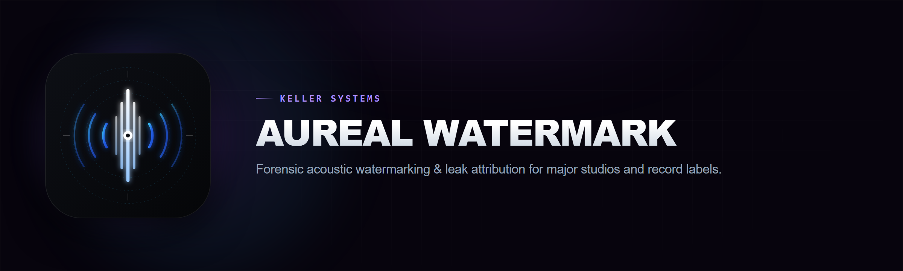

<div align="center">



<br>

[](https://github.com/KELLERBABG/Aureal-Watermark/releases/latest)
[](https://aureal.kellersystems.dev)
[-0891b2?style=flat-square)](docs/TECHNICAL_SPECIFICATIONS.md)
[](https://aureal.kellersystems.dev/pricing.html)

<br>

[**Launch Web Studio**](https://aureal.kellersystems.dev/studio) &bull; [**Commercial Licensing & Pricing**](https://aureal.kellersystems.dev/pricing) &bull; [**Documentation**](https://aureal.kellersystems.dev/docs) &bull; [**Technical Specifications**](docs/TECHNICAL_SPECIFICATIONS.md)

</div>

---

## What is Aureal Watermark?

**Aureal Watermark** embeds a 32-bit identifier into audio using spread-spectrum signal processing. The watermark is designed to be subtle, and the scanner attempts to recover the identifier after supported transformations. Recovery depends on the source audio, codec, and processing.

> **Important limitation:** A matching watermark is a provenance signal, not cryptographic proof of authorship, ownership, or when a file was created. Anyone with access to the software and matching key can generate a matching ID. Retain independent source, recipient, and custody records; this tool is not a substitute for cryptographic signing or a complete provenance system.

---

## Why Use It?

* **Audio Leak Investigation:** Give each listener or preview recipient a unique watermark ID, then check recovered IDs against your distribution records when investigating a leak.
* **Codec Resilience Testing:** Detection has been tested on selected MP3/AAC transcodes and signal transformations; recovery depends on the source audio, codec, and processing.
* **Local Audio Processing:** The DSP embed/detect workflow runs locally. Optional commercial-license activation makes a network request to Polar.sh.

---

## How It Works (In Plain English)

```
[ Your Audio File ] ──► [ Embed Invisible ID (#883921) ] ──► [ Protected Audio ]
                                                                     │
                                                    (Designed to remain subtle; audibility varies by material and playback)
                                                                     │
                                       Later: Someone uploads or leaks your file
                                                                     │
                                                                     ▼
                                                     [ Scan with Aureal Watermark ]
                                                                     │
                                                                     ▼
                                                   "Recovered watermark ID #883921"
```

1. **Pick an ID number:** Choose any serial number (like `#883921` or a recipient's code).
2. **Protect the file:** Aureal embeds the number into subtle frequency layers of your audio.
3. **Audio remains usable:** Embedding is designed to be subtle; audibility may vary with audio material, settings, and playback.
4. **Scan a copy:** Drop supported audio into Aureal to check whether an ID can be recovered. Use independent records to establish ownership and provenance.

---

## Easy Ways to Use It

### Option 1: Standalone Desktop Studio & Windows Executable (Recommended)

1. Download **[`aureal-watermark.exe`](https://github.com/KELLERBABG/Aureal-Watermark/releases/latest/download/aureal-watermark.exe)** from the Releases page.
2. Double-click to launch the offline **Desktop Studio Application**:
   * **Multi-Format Audio Export:** Download masters in WAV 16-bit, WAV 24-bit, or MP3 (320k, 192k, 128k) with built-in offline LAME encoding.
   * **Collision Detector:** Automatic pre-check prevents accidentally over-tagging an already watermarked master.
   * **Cryptographic Auto-ID:** 1-click generation of secure, non-repeating tracking IDs and studio namespace keys.
   * **Local Audio Processing:** DSP runs on-device; license activation may contact Polar.sh.

You can also run it directly via CLI or command prompt:
```bash
# Launch GUI Studio (Default)
./aureal-watermark.exe

# Or run headless CLI operations
./aureal-watermark.exe embed master.wav protected.wav --id 883921
./aureal-watermark.exe detect protected.wav --id 883921
```

---

### Option 2: Web Studio (In Your Browser)

No installation or technical setup needed:

**[Launch Interactive Web Studio &rarr;](https://aureal.kellersystems.dev/studio)**

*(Audio processing runs in your browser. Optional license activation contacts Polar.sh).*

---

### Option 3: Standalone Universal Script (Cross-Platform CLI)

A single, zero-dependency file that runs on **Windows, macOS, and Linux** using standard Node.js (&ge; 18). Supports direct input and output of **MP3, FLAC, AAC, M4A, OGG, AIFF, and WAV** with automatic FFmpeg fallback:

1. Download **[`aureal-watermark.cjs`](https://github.com/KELLERBABG/Aureal-Watermark/releases/latest/download/aureal-watermark.cjs)** from the Releases page.
2. Run from your terminal or command prompt:

```bash
# 1. Embed an ID directly into an MP3, FLAC, or WAV
node aureal-watermark.cjs embed master.wav protected.mp3 --id 883921

# 2. Check an audio file to see if it contains your ID
node aureal-watermark.cjs detect protected.mp3 --id 883921

# 3. Blind scan (automatically extracts any embedded ID from an unknown file)
node aureal-watermark.cjs detect mystery_audio.mp3 --json

# 4. Generate a cryptographically sealed forensic audit proof
node aureal-watermark.cjs detect leak.mp3 --id 883921 --report proof.json --report-txt cert.txt

# 5. Launch your local offline Desktop Studio
node aureal-watermark.cjs gui
```

---

### Option 4: Air-Gapped Docker REST Microservice (For Cloud & Speech Pipelines)

Deploy an air-gapped, zero-dependency HTTP REST daemon on Kubernetes, AWS ECS, or Nomad in 1 command:

```bash
# Launch with Docker Compose
docker compose -f docker/docker-compose.yml up -d
```

The daemon runs rootless on port `8080` with an in-memory `tmpfs` volume:

```bash
# 1. Liveness & Engine Health Probe
curl -s http://localhost:8080/v1/health

# 2. Embed via raw binary stream (WAV, MP3, FLAC)
curl -X POST "http://localhost:8080/v1/embed?id=883921&strength=0.5&band=dual&format=mp3" \
  -H "Content-Type: audio/wav" \
  --data-binary @master.wav \
  --output protected.mp3

# 3. Detect via raw binary stream
curl -X POST "http://localhost:8080/v1/detect?id=883921&report=true" \
  -H "Content-Type: audio/mpeg" \
  --data-binary @protected.mp3
```

Also accepts JSON bodies with base64 audio payloads (`{ "audioBase64": "...", "id": 883921 }`).

---

### Option 5: Watermark Detection Audit Report

Export a report with hashes of the analyzed file, detection metrics, and an HMAC integrity seal. The HMAC uses the supplied key (or a built-in default); it is not a public-key signature and the report alone does not establish authorship, scan time, chain of custody, or legal admissibility:

```bash
auralwatermark detect evidence.mp3 --id 883921 --report proof.json --report-txt cert.txt
```

#### Illustrative Sample Output (`cert.txt`):
```text
==============================================================================
              AUREAL WATERMARK — FORENSIC PROOF CERTIFICATE               
               Watermark Detection Metrics (Illustrative)                
==============================================================================
Date/Time (UTC) : 2026-09-11T09:12:10.476Z
Engine          : Aureal Watermark Forensic DSP Engine v0.2.7
Report Schema   : v1.0.0
------------------------------------------------------------------------------
1. TARGET EVIDENCE FILE
   Path         : evidence.mp3
   Size         : 264,644 bytes
   SHA-256      : 7dafa0b0c58327ed539a87b78ead6c632007b9dff869849489bef82b2cb1c293
   SHA-512      : 82b16b5068978739e3fbb5d4e1a11a7bcb14100342f5b2f1...
------------------------------------------------------------------------------
2. FORENSIC VERIFICATION RESULT
   Result       : [WATERMARK ID MATCH]
   Detected     : YES
   Payload ID   : 883921
   Confidence   : 100.0%
   Bit Error Rate: 0.00%
   CRC Integrity: VALID (OK)
------------------------------------------------------------------------------
3. PHYSICAL-LAYER DSP METRICS
   Eb/N0        : 13.93 dB
   SQNR         : 16.94 dB
   Z-Score      : 32.87
   Carrier Band : 17000 - 19500 Hz
   Sync Method  : preamble
------------------------------------------------------------------------------
4. INTEGRITY SEAL
   Algorithm    : HMAC-SHA256
   Seal Hash    : 9702c8625046347512fe23df534257be752512a650fd8ed072b6aa90d814356b
==============================================================================
Note: Sample fields are illustrative; a watermark match does not independently prove ownership or legal attribution.
==============================================================================
```

---

### Option 6: JavaScript & TypeScript API (With First-Class `.d.ts` Types)

Integrate protection directly into your Node.js or TypeScript applications:

```typescript
import {
  embedWatermark,
  detectWatermark,
  generateForensicReport,
  readWavFile,
  writeWavFile
} from "aureal-watermark";

// Load audio file
const wav = await readWavFile("song.wav");
const format = { sampleRate: wav.sampleRate, channels: wav.channels };

// Embed watermark ID #883921
const protectedAudio = embedWatermark(wav.samples, format, { payloadId: 883921 });
await writeWavFile("song_protected.wav", protectedAudio, { ...format, bitDepth: 16 });

// Scan and verify
const result = detectWatermark(protectedAudio, format, { payloadId: 883921 });

console.log(result.detected);           // true
console.log(result.confidence);         // 1.0 (100%)
console.log(result.ebN0Db);             // +14.2 dB (Signal-to-Noise)
console.log(result.recoveredPayloadId); // 883921
```

---

## Regulatory and C2PA Context (Not a Compliance Claim)

### 1. EU AI Act Article 50 Machine-Readable Synthetic Audio
Article 50 of the European Union AI Act establishes transparency obligations for certain providers and deployers of AI systems. This project does not provide a legal compliance determination or guarantee that its watermark meets those requirements.
* **Metadata limitations:** Audio services may strip or transform metadata during re-encoding.
* **Aureal's role:** Aureal embeds a keyed 32-bit identifier in audio; recovery depends on the source, encoder, and processing. The ID does not itself establish the identity, origin, or authenticity of content.

### 2. The C2PA Content Credentials Persistence Bridge
Aureal's 32-bit ID can be used as an application-level lookup value alongside independently maintained provenance records. Aureal does not create, validate, or recover a C2PA manifest; the repository example is illustrative, not a certified C2PA implementation.

---

## Operational Capabilities & Adversarial Attack Resistance

Aureal is exercised against a local adversarial fixture suite. Results are limited to the fixtures listed here and do not establish universal performance across all content, devices, or services:

| Transformation / Attack Vector | Survives? | Empirical Result & Engineering Notes |
| :--- | :---: | :--- |
| **Selected Multi-Generational Lossy Transcode**<br>*(Test fixture: WAV &rarr; MP3 128k &rarr; AAC 96k &rarr; MP4 &rarr; MP3 64k &rarr; Opus 96k &rarr; WAV)* | **Tested** | Passed in the current local ffmpeg test run. Results vary by source material, encoder, and transformations; this does not establish compatibility with every social platform. |
| **Mid/Side Subtraction (L - R fixture)** | **YES** | Detected in the local fixture only. Orthogonal Mid/Side channel decorrelation ($W_L = \frac{M+S}{\sqrt{2}}, W_R = \frac{M-S}{\sqrt{2}}$) Tested on a synthetic side-channel fixture; results depend on source content and transformation. |
| **Phase-Inversion Downmix Fixture** | **Tested** | The local synthetic fixture passed; behavior depends on the source mix and transformation. |
| **Stereo-to-Mono Downmix Fixture** | **YES** | Detected in the local fixture only. In-phase Mid component reconstructs with $+3\text{ dB}$ signal gain. |
| **Short Snippet Crop (1.8s fixture)** | **Tested** | The local fixture passed; minimum reliable duration depends on band, sample rate, and audio content. |
| **Playback Speed & Pitch Drift ($\pm1.0\%$)**<br>*(Analog tape wow/flutter, speed stretch)* | **YES** | Detected in local resampling fixtures; no general analog wow/flutter guarantee. |
| **Low-Pass Filtering** | **Partial** | The local 16 kHz fixture passed; the 12 kHz and 7 kHz fixtures failed. Filtering below the watermark bands can erase detection data. |
| **High-Pass / Notch Fixtures (1 kHz / 18 kHz)** | **Tested** | The local synthetic fixtures passed; source-specific filtering can still remove the watermark. |
| **Air-Gap Recording (Speaker to Mic)** | **Tested** | Detected in one local room-reverb simulation; this does not establish phone or room recording performance generally. |
| **Extreme Overdrive (+12 dB hard clipping)** | **Tested** | Detected in the local synthetic fixture; results depend on content and processing. |
| **Heavy Broadcast Compression & Limiting** | **Tested** | Detected in one local compressor fixture; results vary with audio and settings. |
| **Additive Background Noise (-20 dB fixture)** | **Tested** | Detected in the local pink-noise fixture; results vary with signal-to-noise ratio and content. |
| **Sample-Rate Conversion Fixtures** | **Tested** | Selected conversion tests passed; results depend on converter quality and source audio. |
| **Multi-Layer Watermarking** | **Tested** | Distinct-key watermark layers were detected in the local synthetic fixtures; this limited result is not a general coexistence guarantee. |
| **Re-embedding with Same Key, Different ID** | **Not reliable** | Current local tests show neither the original nor replacement ID is reliably detected after re-embedding. Treat this as a known limitation; do not claim overwrite protection. |

---

## Deep Dive & Technical Documentation

For audio engineers, DSP researchers, and developers who want to inspect the mathematics, frequency bands, and algorithms:

* [**Commercial Licensing & Enterprise SLA**](docs/COMMERCIAL_LICENSING.md) — Production licensing terms, pricing tiers, and compliance specifications.
* [**Technical Specifications & Benchmarks**](docs/TECHNICAL_SPECIFICATIONS.md) — DSSS carrier frequencies, BPSK modulation parameters, and measured compression tests.
* [**Codebase Wiki**](docs/CODEBASE_WIKI.md) — Complete file-by-file reference for every function and DSP module.
* [**Whitepaper**](docs/WHITEPAPER.md) — Formal threat model, detection statistics, and academic background.
* [**System Architecture**](docs/ARCHITECTURE.md) — Signal processing pipelines and audio data flow.
* [**Payload Wire Format**](docs/PAYLOAD-FORMAT.md) — 48-symbol codeword specification and CRC-16 checksums.

---

## Commercial Licensing & Enterprise SLA (confirm current offer before publishing)

Aureal Watermark is distributed under a **Dual License**:

* **Personal, Academic & Hobby Use:** Completely free and open-source under the [PolyForm Noncommercial License 1.0.0](LICENSE.md).
* **Commercial & Enterprise Use:** A commercial production license is required for commercial releases, label promo pools, SaaS audio pipelines, and AI speech platforms.

### Commercial Pricing Matrix

| Tier | Price | Includes |
| :--- | :--- | :--- |
| **Solo Creator / Indie Studio** | **$249** *(one-time)* | Unlimited Perpetual License: Unrestricted commercial rights, Universal CLI, Web Studio. |
| **Promo Leak Suite / Label** | **$499** *(one-time)* | Unlimited Perpetual License: Batch leak distributor, one-click forensic audit script, priority leak support. |
| **B2B Audio Marketplace** | **$2,900 – $5,900 / yr** | Headless backend integration rights, commercial export hook SLA, unlimited embeds. |
| **Voice AI & Speech Platforms** | **From $4,900 / yr** *(Custom Enterprise)* | Custom integration services; obtain independent legal and standards review for regulatory or C2PA requirements. |
| **Audio Forensics & Legal Labs** | **$1,499** *(perpetual)* | Detection reporting and technical review tools; no court-admissibility claim. |

For current commercial pricing, checkout availability, and terms, confirm the [**Interactive Pricing Page**](https://aureal.kellersystems.dev/pricing), consult [**docs/COMMERCIAL_LICENSING.md**](docs/COMMERCIAL_LICENSING.md), or contact **[business@kellersystems.dev](mailto:business@kellersystems.dev)**.

